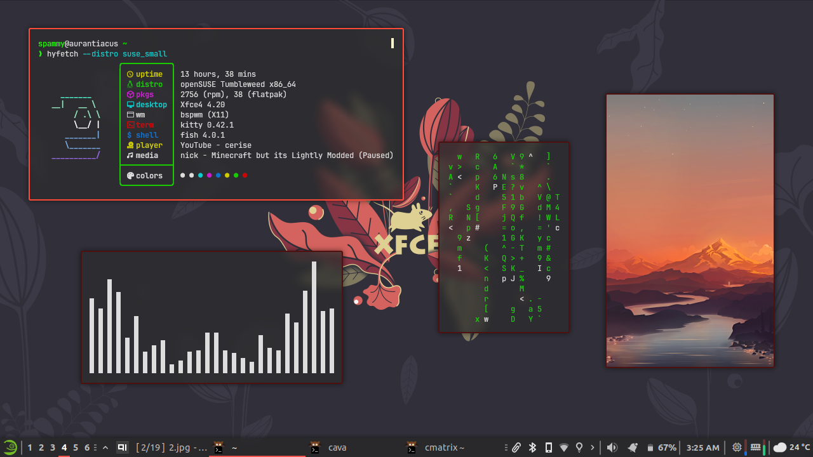

# spammy-xfbsp-dotfiles
| tiled layout | floating windows |
| -- | -- |
 | 

## a mix of xfce and bspwm
### setup instructions:
0. install the following: xfce bspwm picom kitty
1. clone this repository:
```
git clone https://github.com/serspammy/spammy-xfbsp-dotfiles/edit/main/README.md
```
2. copy+paste contents of `.config/` into `~/.config/`

(you may need to press `ctrl+h` to reveal the `.config/` directory inside of the cloned repository's directory. my bad for naming it like that, i forgot that linux was like that lmao)

3. open **Keyboard**, and go to **Application Shortcuts**
4. remove all shortcuts, as they will be handled by sxhkd instead
5. open **Session and Startup**
6. go to **Current Session**
7. for xfwm4 and xfce4-panel, set restart style to **never**
8. go to **Application Autostart**
9. add entries for bspwm, picom and xfce4-panel:
```
Name: BSPWM
Description: Binary Space Partitioning Window Manager
Command: bspwm
Trigger: on login

Name: Picom
Description: x11 compositing manager
Command: picom -b
Trigger: on login

Name: Xfce Panel
Description: Panel for the Xfce Desktop Environment
Command: xfce4-panel
Trigger: on login
```
10. logout, and back in

sxhkd will automatically run alongside bspwm, no need to make an entry for that. optionally, you could actually just use keyboard settings for shortcuts, and forego sxhkd, but i find using sxhkd a little more convenient

the reason we have to disable xfce4-panel in 'Current Session', only to make a startup entry for it, is because leaving it like that would have the panel be invisible while still running. this is a workaround to that weird behavior

--- 
### basic stuff to install
- bspwm (duh)
- xfce4 (desktop environment)
- picom (EYE CANDY 🤑🤑🤑🤑)
- kitty (terminal)

#### other things in screenshots:
- fastfetch
  - hyfetch for the gays
- fish
- qimgv
- cava
- cmatrix
- rmpc
- btop
---
### nerd fonts used:
- Ubuntu Mono (proportional/normal font)
- JetbrainsMono (monospace/terminal font)

  https://www.nerdfonts.com/font-downloads

### gtk/qt theme:
- https://github.com/vinceliuice/vimix-gtk-themes
- https://github.com/vinceliuice/vimix-kde
-----
### spammy's notes:

1. i suggest using `xfce4-session-settings` to handle startup programs
2. if you ever need to, you can replace bspwm with xfwm4 by opening a terminal and running `xfwm4 --replace` (unless you've uninstalled xfwm4)
